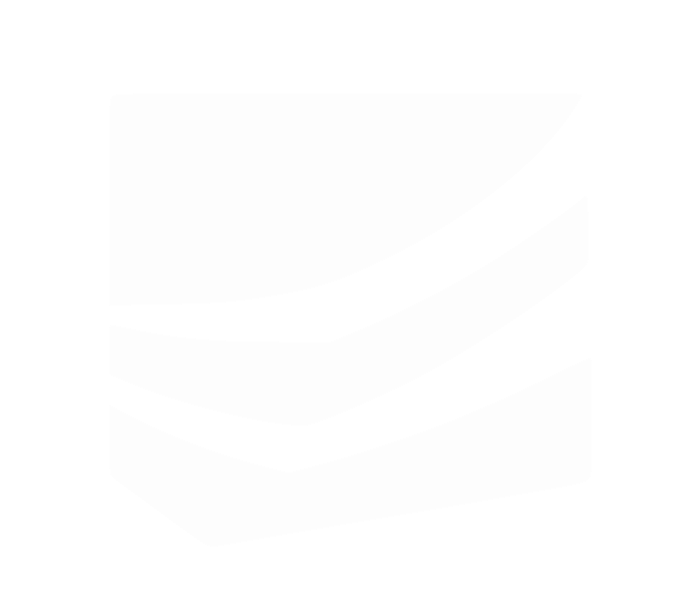

<p align="center">
  
</p>

<h1 align="center">Knowledge Plane</h1>

<p align="center">
  Shared memory for AI agents and teams -- stops your tools from forgetting.
</p>

<p align="center">
  <a href="LICENSE"></a>
  
  
</p>


## What is Knowledge Plane?

Knowledge Plane is an MCP server that gives AI agents and teams persistent, shared memory. It stores facts as a knowledge graph with vector embeddings, automatically consolidates related facts into knowledge cards, and provides hybrid search (vector + graph traversal). Native MCP protocol support means any MCP-compatible AI tool (Claude, Cursor, etc.) can read and write shared knowledge.

## Features

- **Persistent agent memory** -- Facts stored in ArangoDB knowledge graph with vector embeddings
- **MCP-native** -- Drop-in memory for Claude Desktop, Cursor, and any MCP client
- **Hybrid search** -- Vector similarity + graph traversal + optional BM25
- **Auto-consolidation** -- Background workers merge related facts into knowledge cards
- **File upload and extraction** -- Upload documents, extract facts automatically
- **Web dashboard** -- Browse, search, and manage your knowledge graph
- **Multi-workspace** -- Isolated knowledge spaces per team or project
- **OAuth + API keys** -- Google/GitHub OAuth and API key authentication
- **REST API** -- Full CRUD API alongside the MCP server
- **Audit trails** -- Track who created and modified every fact

## Quick Start

```bash
# Clone and install
git clone https://github.com/camplight/knowledgeplane.git
cd knowledgeplane
npm run bootstrap

# Set up environment
./scripts/setup-env.sh    # Creates .env files from examples

# Start everything (ArangoDB + all services)
npm run dev
```

Services start at:

| Service | URL |
|---------|-----|
| Web Dashboard | http://localhost:3000 |
| MCP Server | http://localhost:8080 |
| REST API | http://localhost:8081 |
| ArangoDB | http://localhost:8529 |

For detailed setup including OAuth and ngrok, see [Getting Started](./GETTING_STARTED.md).

## MCP Integration

### Claude Desktop

Add to your Claude Desktop MCP config:

**Option 1: HTTP/SSE (recommended)**

```json
{
  "mcpServers": {
    "knowledgeplane": {
      "url": "http://localhost:8080/mcp",
      "headers": {
        "Authorization": "Bearer YOUR_API_KEY"
      }
    }
  }
}
```

**Option 2: stdio adapter**

```json
{
  "mcpServers": {
    "knowledgeplane": {
      "command": "node",
      "args": ["apps/mcp-server/dist/mcp/adapter.js"],
      "env": {
        "KNOWLEDGEPLANE_API_URL": "http://localhost:8080",
        "KNOWLEDGEPLANE_API_KEY": "YOUR_API_KEY"
      }
    }
  }
}
```

## Architecture

```
knowledgeplane/
├── apps/
│   ├── mcp-server/          # MCP protocol server (Fastify)
│   ├── rest-api/            # REST API (Express)
│   ├── webapp/              # Web dashboard (Next.js)
│   └── background-workers/  # Consolidation & embeddings
├── packages/
│   ├── db/                  # ArangoDB models & queries
│   ├── aimodel/             # LLM abstraction layer
│   ├── api-core/            # Shared API utilities
│   └── file-processor/      # Document parsing & extraction
└── infra/                   # Docker Compose configs
```

## Documentation

| Guide | Description |
|-------|-------------|
| [Getting Started](./GETTING_STARTED.md) | Quick start and setup |
| [Development Guide](./DEVELOPMENT.md) | Local development with ngrok |
| [Deployment Guide](./DEPLOYMENT.md) | Cloud deployment (Railway, etc.) |
| [Environment Setup](./ENV_SETUP.md) | All environment variables |
| [API Specification](./docs/SPEC.md) | Complete API reference |

## Contributing

We welcome contributions! Please see [CONTRIBUTING.md](./CONTRIBUTING.md) for guidelines.

## License

[Apache-2.0](./LICENSE)
